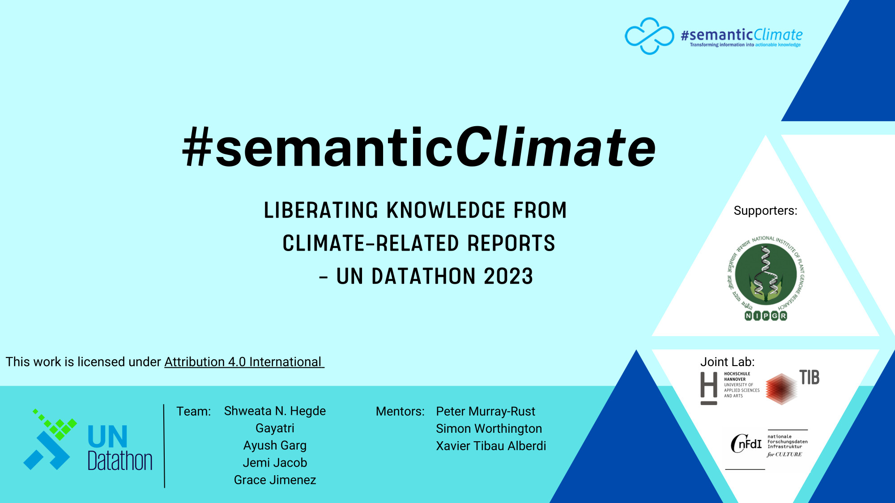

# UN Datathon 2023

 #semanticClimate's code and material for a hack and submission to the [UN Datathon 2023](https://unstats.un.org/bigdata/events/2023/un-datathon/). 

 The work was completed in the Geneva SDG Lab 3-5 November 2023.

## #semanticclimate Products / use cases

  1. Climate Vulnerability assessment  tracker for IPCC Reports
  1. Semantic Glossary for UN IPCC Readers
  1. PDF Reader for UN Diplomats

## About the submission: Problem statement, methodology, & data

Problem statement: Support a user of UN Data who is exploring a questions on ‘Climate Vulnerability Indexes’ with Big Data analysis of the global scientific literature, with geolocation.

Methodologies: Iterative software development using hackathons and rapid prototyping, creating replicable frameworks, open notebook science 

UN Data used: Carbon Disclosure Project (CDP), 2022 Cities Climate Hazards - https://data.cdp.net/Climate-Hazards/2022-Cities-Climate-Hazards/rdq4-d52n 

## Demos

  - [Climate Vulnerability assessment tracker for IPCC Reports](https://github.com/semanticClimate/un-datathon-2023/blob/main/climate_vulnerablity_assessement_tracker.ipynb)
  - [Semantic Glossary for UN IPCC Readers](https://vivliostyle.vercel.app/#src=https://raw.githubusercontent.com/semanticClimate/glossary-demo/main/html/index.html)
  - [PDF Reader for UN Diplomats](https://github.com/petermr/pyamihtml)

## Code

  - [Climate Vulnerability assessment tracker for IPCC Reports](https://github.com/semanticClimate/un-datathon-2023/)
  - [Semantic Glossary for UN IPCC Readers](https://github.com/semanticClimate/glossary-demo)
  - [PDF Reader for UN Diplomats](https://github.com/petermr/pyamihtml)

## Slidedeck

[PDF](slides/semanticClimate-undatathon23.pdf) | [PPTX](slides/semanticClimate-undatathon23.pptx)

## Video presentation

[YouTube](https://www.youtube.com/watch?v=XjfvvA_yVXw) pitch video.

## License

Code: See [LICENSE](LICENSE) | Apache License Version 2.0, January 2004 http://www.apache.org/licenses/

Code - All code OSI License compliant

Content - This work is licensed under <a href="http://creativecommons.org/licenses/by/4.0/?ref=chooser-v1" target="_blank" rel="license noopener noreferrer" style="display:inline-block;">Attribution 4.0 International</a>

## Supporters

NIGPR | TIB | NFDI4Culture | Leibniz Joint Lab Future Libraries & Research Data: (Hannover University of Applied Sciences and Arts - HsH, TIB) | Geneva SDG Lab 